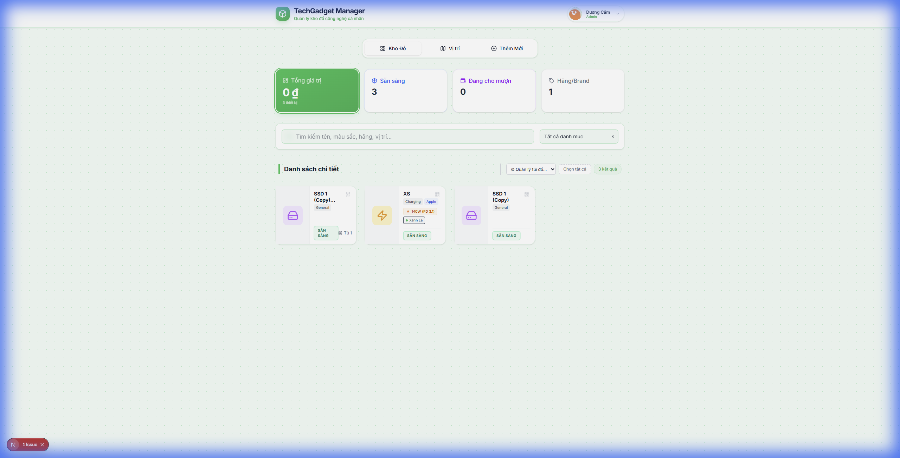

# 📦 Tech Gadget Manager


**Tech Gadget Manager** là ứng dụng tự-host (self-hosted) giúp bạn quản lý kho đồ công nghệ, thiết bị Homelab, dây cáp, sạc... một cách khoa học. 

Được thiết kế với giao diện hiện đại **Mobile-First**, ứng dụng hoạt động mượt mà trên cả điện thoại và máy tính, hỗ trợ cài đặt dạng PWA.

## 📸 Demo

<table>
  <tr>
    <td align="center">
      
      <br>
      <em>Giao diện quản lý chính</em>
    </td>
    <td align="center" width="30%">
      
      <br>
      <em>Giao diện Mobile</em>
    </td>
  </tr>
</table>

## ✨ Tính Năng Chính

-   📦 **Quản lý tồn kho**: Lưu trữ thông tin chi tiết (Ảnh, Tên, Loại, Serial, Vị trí...).
-   ⚡ **Thao tác nhanh**: Tìm kiếm tức thì, chức năng chọn nhiều (bulk actions), xuất mã QR.
-   📱 **Tối ưu Mobile**: Thanh công cụ nổi, bố cục thích ứng, hỗ trợ vuốt chạm.
-   🌓 **Dark Mode**: Giao diện tối sang trọng, tự động theo hệ thống.
-   🐳 **Dễ dàng triển khai**: Hỗ trợ Docker, Unraid, Portainer ngay lập tức.

## 🚀 Cài Đặt (Docker Compose)

Đây là cách nhanh nhất để sử dụng ứng dụng.

### 1. File `docker-compose.yml`

```yaml
version: '3.8'

services:
  app:
    container_name: tech-gadget-manager
    image: ghcr.io/duongcamcute/tech-gadget-manager:latest
    restart: always
    ports:
      - "3000:3000"
    environment:
      # Database SQLite sẽ được lưu trong volume
      - DATABASE_URL=file:/app/db/prod.db
      - NODE_ENV=production
    volumes:
      # Map thư mục lưu dữ liệu ra ngoài để không mất khi update
      - ./data:/app/db
```

### 2. Chạy lệnh

```bash
docker-compose up -d
```
Truy cập: `http://localhost:3000`

---

## 🔑 Đăng Nhập Lần Đầu (Quan Trọng)

Khi ứng dụng chạy lần đầu tiên (với database mới tinh), hệ thống sẽ tạo tài khoản mặc định:

-   **Username**: `admin`
-   **Password**: `admin`

> **Lưu ý**: Hãy đổi mật khẩu ngay trong phần **Cài đặt** -> **Tài khoản** sau khi đăng nhập.

---

## 👩‍💻 Dành Cho Developer

Bạn muốn đóng góp code hoặc tùy biến chức năng? Xem chi tiết tại:
👉 [**Hướng dẫn phát triển (Developer Guide)**](CONTRIBUTING.md)

---

## ⚙️ Cấu Hình Nâng Cao

| Biến Môi Trường | Mặc Định | Giải Thích |
| :--- | :--- | :--- |
| `DATABASE_URL` | `file:/app/db/prod.db` | Đường dẫn SQLite (trong container). |
| `NODE_ENV` | `production` | Chế độ chạy (dev/production). |
| `PORT` | `3000` | Cổng mặc định của ứng dụng. |

---

## 📝 License

Copyright © 2024 DuongCam. Released under the [MIT License](LICENSE).
